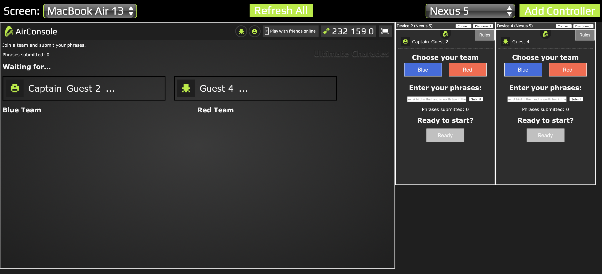
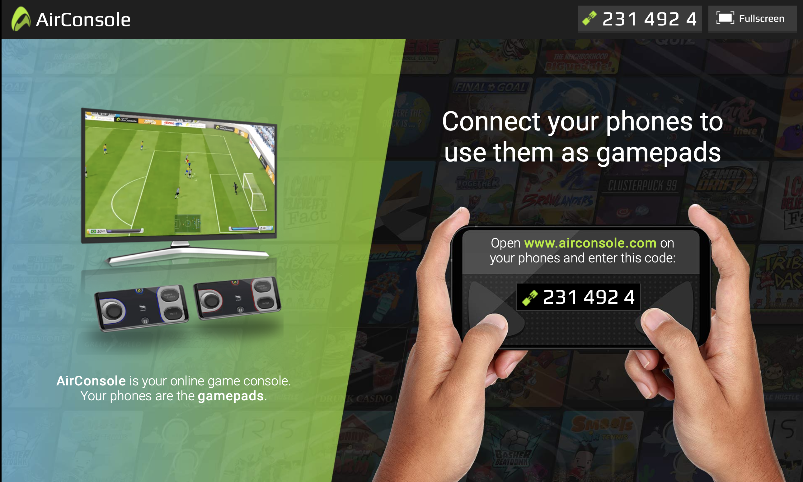

# Ultimate Charades

Ultimate Charades using the AirConsole API.

Load the screen on a desktop and use your phones as controllers.

## How To Run

See the [AirConsole Developers](https://developers.airconsole.com/#!/) site for full instructions.

For development, serve on localhost and go to http://www.airconsole.com/simulator/#http://localhost:8888/UltimateCharades/.

For production, if you upload the Ultimate Charades files to a url path like mysite.com/ultimateCharades, you would go to http://www.airconsole.com/#http://mysite.com/ultimateCharades.

## How to Play

You can also find these instructions in the game.

### Summary

Ultimate Charades is a unique take on the classic party game.

The goal is to see which team can guess the most phrases over three rounds.

Each round uses the same phrases, so be sure to pay attention while the other team gives clues too.
                    
### Setup

- The first player that joins the game is the Captain, who begins each round when everyone is ready.
- Start by selecting your team and entering phrases.
- Phrases can be movie titles, song lyrics, or anything really.
- Use the AirConsole icon to change your nickname.
- Decide which team will go first, and the turn order on each team.

### Instructions

- Keep track of turn order outside the game.
- Red and blue teams alternate clue givers.
- You'll see a button to press when it's your turn.
- The timer begins when you press "Start clue giving."
- Only players on your team are allowed to guess.
- You'll see the phrase for which you need to give clues. Each round has different rules for clue giving.
- If your team guesses the phrase *exactly*, press "Correct."
- If you make a mistake, like saying a word in the phrase, press "End Turn."
- Once the timer runs out, or the last phrase in the round is guessed, your turn will end automatically.
- If you ended the round, you go first the next round using your remaining time. Otherwise play passes to the next team.
- Continue taking turns guessing until all three rounds have ended, then check the score to see which team wins.

### Round Rules

#### Round One

The clue giver can say anything they want except for the words in the phrase.
Don't use any gestures, speaking only. The phrase has to be guessed *exactly*, especially because it will continue to be used in subsequent rounds.

#### Round Two

This is the familiar charades round. No talking or sounds of any kind.

#### Round Three

In this round you can only give a **one-word** clue. 
Avoid any intonation while giving the clue, and no gestures.

